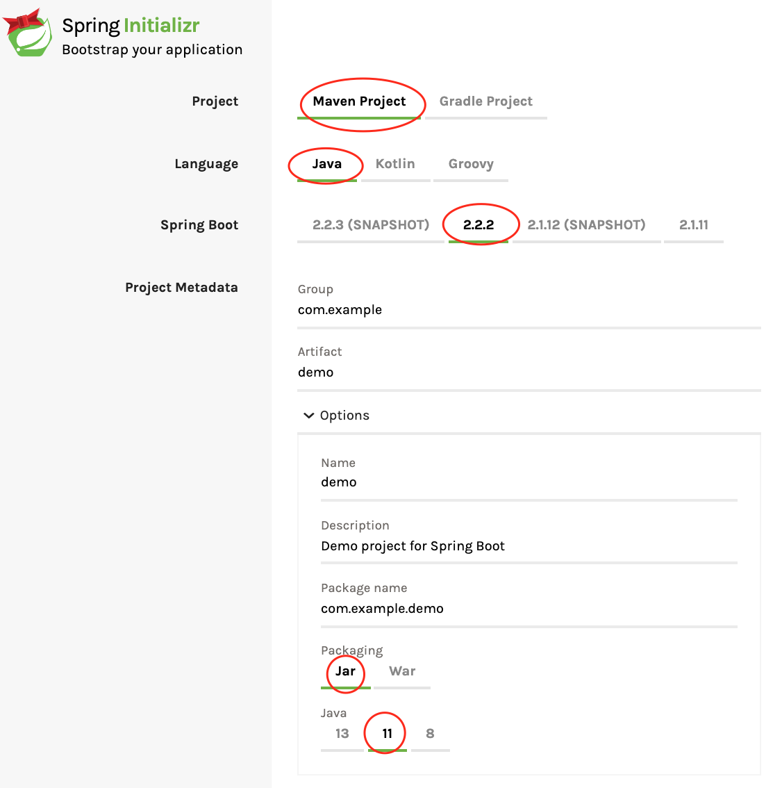

= How to setup `spring-data-aerospike` in Spring Boot application
:toc:

:spring-boot-version: 2.3
:spring-data-aerospike-version: 2.4.1.RELEASE

== Setting up the project

In this section we'll cover setup of the project from the start.

First, we'll need to setup the basic project structure.
You can do it either manually if you are familiar with the process or do it via https://start.spring.io/[Spring Initializr].

In Spring Initializr you'll need to select:

- Project: https://stackoverflow.com/a/13335439/688926[Maven] project
- Language: Java
- https://spring.io/projects/spring-boot[Spring Boot]: {spring-boot-version}
- Java: 11

.Options to select

Press Generate button in the bottom of the page and you'll get zip with initial project. Import project into your
favorite IDE and run the test. It should be green and that means that you are ready to continue to the next section.

== Adding `spring-data-aerospike` dependency

[NOTE]
====
`spring-data-aerospike` is a Community project and the dependency is not managed by Spring, it has it's own release cycle
and is not included into Spring Boot dependency management. Available versions can be checked on
https://mvnrepository.com/artifact/com.aerospike/spring-data-aerospike[Maven Central].

https://github.com/aerospike-community/spring-data-aerospike#spring-boot-compatibility[Spring Boot compatibility] can be
checked for the version of `spring-data-aerospike` that is compatible with the specific Spring Boot version.
====

In our case we are going to use `spring-data-aerospike` {spring-data-aerospike-version} as we have Spring Boot {spring-boot-version}:

.pom.xml
[source,xml]
----
        <dependency>
            <groupId>com.aerospike</groupId>
            <artifactId>spring-data-aerospike</artifactId>
        </dependency>
----

== Creating Aerospike repository

We will be using https://projectlombok.org/[Lombok] library to omit the boilerplate code in the entity class.
Add `lombok` into your `pom.xml`:

.pom.xml
[source,xml]
----
        <dependency>
            <groupId>org.projectlombok</groupId>
            <artifactId>lombok</artifactId>
            <scope>provided</scope>
        </dependency>
----

We are going to use the movies domain in this project, so to be able to read and save our movies into Aerospike we will need to create:

. document(entity) class that represents our domain model,
. repository class that provides https://en.wikipedia.org/wiki/CRUD[CRUD] operations.

Movie document class will look the following way:

.MovieDocument.java
[source,java]
----
package com.example.demo.persistence;

import lombok.AllArgsConstructor;
import lombok.Builder;
import lombok.Value;
import lombok.experimental.NonFinal;
import org.springframework.data.aerospike.mapping.Document;
import org.springframework.data.aerospike.mapping.Field;
import org.springframework.data.annotation.Id;
import org.springframework.data.annotation.Version;

@Value // <1>
@Document(collection = "demo-service-movies") // <2>
@Builder(toBuilder = true) // <3>
// Spring Data object creation can use all-args constructor instead of reflection which is much faster
@AllArgsConstructor // <4>
public class MovieDocument {

    @Id // <5>
    String id;

    @Field // <6>
    String name;

    @Field("desc")  // <7>
    String description;

    @Field
    double rating;

    @Version // <8>
    @NonFinal
    long version;
}
----

Document explained:

<1> https://projectlombok.org/features/Value[`@Value`] makes class immutable, all fields are made private and final,
`toString()`, `equals()`, `hashCode()`, field getters and all args constructor are generated.

<2> `@Document(collection = "demo-service-movies")` marks a class as an entity to be persisted to Aerospike. It also allows to specify set name, expiration and touch on read values. In current example custom set name is specified via `collection`. Please note that a set name cannot contain the ':' or ';' characters. (See more https://www.aerospike.com/docs/guide/limitations.html[limitations])

<3> `@Builder` provide Builder API for a class.

<4> `@AllArgsConstructor` creates public all-args constructor for a class (which is hidden by `@Builder`).
Spring Data can use all-args constructor instead of reflection to https://docs.spring.io/spring-data/data-commons/docs/current/reference/html/#mapping.object-creation[gain performance boost] for object creation.

<5> `@Id` marks a field as the primary key.

<6> `@Field` is optional, can be set just for the clarity purpose.

<7> `@Field("desc")` configures the name of a field to be used when persisting the document. This value will be used as a bin name instead of the original field name.

<8> `@Version` enables optimistic locking, so that concurrent updates are not lost when saving an entity. Note that if concurrent update fails -- `OptimisticLockingFailureException` is thrown.

[NOTE]
====
Aerospike has https://www.aerospike.com/docs/guide/limitations.html[limitation] on the bin name length.
If your document contains field with name that exceeds this limit, specify short name in `@Field` annotation:
----
    @Field("shortName")
    String veryLoooongFieldName;
----
====

Create Movie Repository interface:

.MovieRepository.java
[source,java]
----
package com.example.demo.persistence;

import org.springframework.data.repository.CrudRepository;

public interface MovieRepository extends CrudRepository<MovieDocument, String> { // <1>
}
----

Repository explained:

<1> `CrudRepository` provides sophisticated CRUD functionality for the entity class.

== Configuring connection to Aerospike

//TODO: autoconfiguration coming soon. Add link to repo

To configure connection to Aerospike you'll need to create configuration class that extends `AbstractAerospikeDataConfiguration`.
Basic setup requires `getHosts()` and `namespace()` methods to be implemented,
but you can also override e.g. `getClientPolicy()` to specify custom configuration for the Aerospike client,
or `customConverters()` to add custom converters.

We are going to use
https://docs.spring.io/spring-boot/docs/current/reference/html/spring-boot-features.html#boot-features-external-config-typesafe-configuration-properties[`@ConfigurationProperties`]
for binding Aerospike configuration properties to POJO. Since connection parameters are required, configuration needs to be validated.
To enable validation add `hibernate-validator` dependency to `pom.xml` or `spring-boot-starter-validation`:

.pom.xml
[source,xml]
----
        <dependency>
            <groupId>org.springframework.boot</groupId>
            <artifactId>spring-boot-starter-validation</artifactId>
        </dependency>
----

Simple configuration will look the following way:

.AerospikeConfiguration.java
[source,java]
----
package com.example.demo.persistence.configuration;

import com.aerospike.client.Host;
import com.example.demo.persistence.CommentsKey;
import com.example.demo.persistence.MovieRepository;
import com.example.demo.persistence.article.ArticleDocument;
import com.example.demo.persistence.article.ArticleDocumentConverters;
import com.example.demo.persistence.user.UserDataConverters;
import lombok.Data;
import org.springframework.beans.factory.annotation.Autowired;
import org.springframework.boot.context.properties.ConfigurationProperties;
import org.springframework.boot.context.properties.EnableConfigurationProperties;
import org.springframework.context.annotation.Configuration;
import org.springframework.data.aerospike.config.AbstractAerospikeDataConfiguration;
import org.springframework.data.aerospike.repository.config.EnableAerospikeRepositories;
import org.springframework.validation.annotation.Validated;

import javax.validation.constraints.NotEmpty;
import java.util.Collection;
import java.util.List;

@EnableAerospikeRepositories(basePackageClasses = MovieRepository.class)
@EnableConfigurationProperties(AerospikeConfiguration.AerospikeConfigurationProperties.class)
@Configuration
public class AerospikeConfiguration extends AbstractAerospikeDataConfiguration {

    @Autowired
    AerospikeConfigurationProperties properties;

    @Override
    protected Collection<Host> getHosts() {
        return Host.parseServiceHosts(properties.getHosts());
    }

    @Override
    protected String nameSpace() {
        return properties.getNamespace();
    }

    @Override
    protected List<?> customConverters() {
        return List.of(
                CommentsKey.CommentsKeyToStringConverter.INSTANCE,
                CommentsKey.StringToCommentsKeyConverter.INSTANCE,
                UserDataConverters.MapToUserDataToConverter.INSTANCE,
                UserDataConverters.UserDataToMapConverter.INSTANCE,
                ArticleDocumentConverters.AerospikeReadDataToArticleDocumentToConverter.INSTANCE,
                new ArticleDocumentConverters.ArticleDocumentToAerospikeWriteDataConverter(properties.getNamespace(), ArticleDocument.SET_NAME)
        );
    }

    @Data
    @Validated // add this annotation if you want @ConfigurationProperties to be validated!
    @ConfigurationProperties("aerospike")
    public static class AerospikeConfigurationProperties {

        @NotEmpty
        String hosts;

        @NotEmpty
        String namespace;
    }
}
----

Now when you run `contextLoads` test you'll get exception:
----
Caused by: org.springframework.boot.context.properties.bind.validation.BindValidationException: Binding validation errors on aerospike
   - Field error in object 'aerospike' on field 'hosts': rejected value [null]; ...(message omitted)
   - Field error in object 'aerospike' on field 'namespace': rejected value [null]; ...(message omitted)
----

This is expected, as Spring was not able to find neither `aerospike.hosts` nor `aerospike.namespace` properties. They are required to setup the connection to Aerospike.

== Testing

To fix the test we need a running Aerospike server.
For the test purposes you can use https://github.com/testcontainers/testcontainers-spring-boot[`embedded-aerospike`] library based on https://github.com/testcontainers[`testcontainers`].

NOTE: `spring-cloud-starter` is required to be present on classpath. If you are not using Spring Cloud you can add `spring-cloud-starter` with test scope.

.pom.xml
[source,xml]
----
        <dependency>
            <groupId>org.springframework.boot</groupId>
            <artifactId>spring-boot-starter-test</artifactId>
            <scope>test</scope>
            <exclusions>
                <exclusion>
                    <groupId>org.junit.vintage</groupId>
                    <artifactId>junit-vintage-engine</artifactId>
                </exclusion>
            </exclusions>
        </dependency>

        <dependency>
            <groupId>org.springframework.cloud</groupId>
            <artifactId>spring-cloud-starter</artifactId>
            <scope>test</scope>
        </dependency>
        <dependency>
            <groupId>com.playtika.testcontainers</groupId>
            <artifactId>embedded-aerospike</artifactId>
            <scope>test</scope>
        </dependency>
----

This will setup Aerospike container when the test starts.

Add Aerospike configuration to the test resources:

./test/resources/application.properties
----
aerospike.hosts=${embedded.aerospike.host}:${embedded.aerospike.port}
aerospike.namespace=${embedded.aerospike.namespace}
----

and run the test. It will be green now.

To verify that the repository is actually working let's add some basic tests:

.MovieRepositoryTests.java
[source,java]
----
package com.example.demo;

import com.example.demo.persistence.MovieDocument;
import com.example.demo.persistence.MovieRepository;
import org.junit.jupiter.api.BeforeEach;
import org.junit.jupiter.api.Test;
import org.springframework.beans.factory.annotation.Autowired;

import java.util.UUID;

import static org.assertj.core.api.Assertions.assertThat;

public class MovieRepositoryTests extends DemoApplicationTests {

    String id;

    MovieDocument movie;

    @Autowired
    MovieRepository repository;

    @BeforeEach
    void setUp() {
        id = UUID.randomUUID().toString();
        movie = new MovieDocument(id, "Inception", "Origin of an idea", 8.8, 0L);
    }

    @Test
    public void save_savesMovie() {
        repository.save(movie);

        assertThat(repository.findById(id)).hasValue(movie);
    }

    @Test
    public void exists_returnsTrueIfMovieIsPresent() {
        repository.save(movie);

        assertThat(repository.existsById(id)).isTrue();
    }

    @Test
    public void deleteById_deletesExistingMovie() {
        repository.save(movie);

        repository.deleteById(id);

        assertThat(repository.findById(id)).isNotPresent();
    }

    @Test
    void deleteById_doesNothingForNonexistingMovie() {
        repository.deleteById(id);
    }
}
----